# Vehicle Manipulator

  ## License
  
  [Creative Commons licenses (for documentation)](http://creativecommons.org/publicdomain/zero/1.0/)

  ## Contents
  ---------
  - [License](#license)
  - [Description](#description)
  - [Installation](#installation)
  - [Usage](#usage)
  - [Contribution](#contribution)
  - [Tests](#tests)
  - [Questions](#questions)

  ## Description
  This program will allow you to either create a new vehicle and manipulate it from a set of listed actions or choose from a selection of already created vehicles to manipulate.  In addition any vehicles created will then be added to the list of previously generated vehicles and be usable from then on.

  ## Installation
  First you will need to clone the repo to your own local storage. 
  
  `` git clone git@github.com:bjaegerthomas/Vehicle-Manipulator.git ``
  
  Then you will navigate to the "dist" folder inside the localalized repo you just created.

  Once inside the dist folder you will simply type from the terminal line:

  `` node index.js ``

  Then hit enter to initialize the program.

  ## Usage
  After you have initialized the program you will be prompted to either create a new vehicle or perform an action on an existing vehicle:

  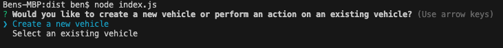

  Let's begin by choosing a pre-existing vehicle. Using the arrow keys, navigate to your selection and press enter.
  You will then be presented with the choice of three pre-generated vehicles. One truck, one car, and one motorbike.

  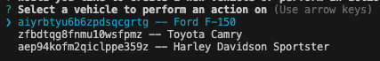

  For now we will select the car by navigating using the arrow keys and hitting enter after our selection is highlighted.
  Once we have chosen our vehicle we will be presented with a series of actions we can perform with it.

  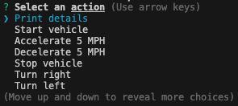

  In order to see all of the options available for the vehicle you have selected you will need to navigate up and down using the arrow keys. The options will continue to loop in order no matter which direction you navigate.
  
  You will need to start the vehicle before you are able to perform actions on it like accelerating or decelerating. You may continue to manipulate the vehicle as much as you want via the commands listed. When you are finished with the current vehicle you can choose the option "select or create another vehicle" to continue using the program with a different vehicle.

  When you have finished with the program completely, simply choose the "exit" option from the list of proposed actions.

  ----------------------------------------------------------------------------------------------------------------------

  The actions available for manipulating the vehicles are the same for each style of vehicle but there are two additional actions available depending on the vehicle choosen.

  When choosing a motorbike you will have an additional option of doing a "Wheelie."

  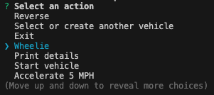

  When choosing a truck you will have an additional option of "Tow"-ing another vehicle.

  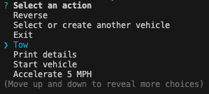

  Once you have selected the "Tow" option you will be asked which vehicle you want to tow from the available list of vehicles.

  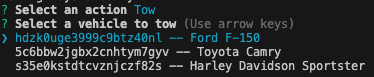

  Once you have selected a vehicle and hit enter the program will state that you are towing the selected vehicle.

  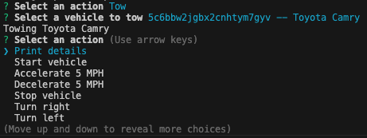

  ----------------------------------------------------------------------------------------------------------------------

  Finally if you would like to create your own vehicle to add to the list of available vehicles to choose from, select "Create a new vehicle":

  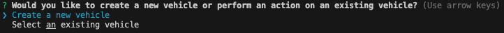

  Then choose the type of vehicle you would like to create:

  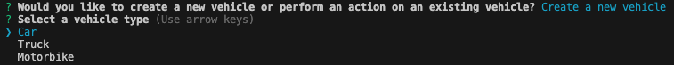

  We'll choose a truck. From here it will ask you what "Color" you would like your truck to be:

  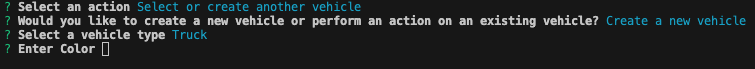

  Then it will ask for the "Make" of the truck:

  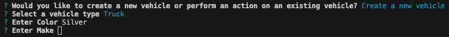

  Then it will ask for the "Model" of the truck:

  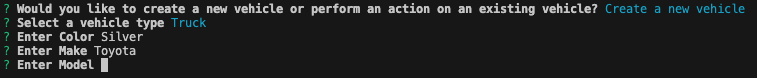

  Then it will ask for the "Year" of the truck:

  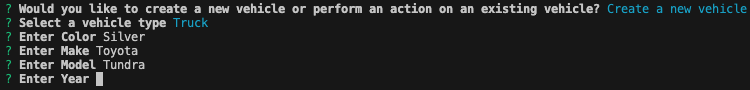

  Then it will ask for the "Weight" of the truck:

  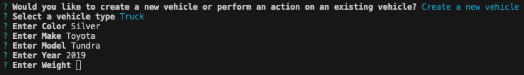

  Then it will ask for the "Top Speed" of the truck:

  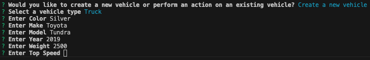

  Then it will ask for the "Towing Capacity" of the truck:

  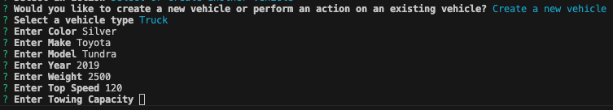

  Once you have entered the towing capacity (a truck only option) you will then be offered the ability to perform actions on your created vehicle.

  

  From here if you choose to "Select or create another vehicle" and then choose "Select an existing vehcile" in the following prompt, you will see your newly
  created vehicle now available as a selectable option.

  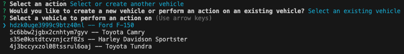

  ## Contribution
  After cloning the repository be sure to create a new branch for your feature or fix.
  Make your changes and commit them with descriptive messages.
  Submit a Pull Request with clear explanations of your modifications.
  Use meaningful variable names and comments.
  Follow guidelines for Javascript and Typescript code formatting.

  ## Tests
  Below is a video link walkthrough of the program being run and test answers being given to show functionality.

  https://drive.google.com/file/d/1z1YEezYXWxMN-DV0gYL0_Dhb1OVh3NIQ/view

  ## Questions
  Have any questions about this or other projects?
  Check out my github page through the link below and feel free to reach out via the provided email address.

  - GitHub: [bjaegerthomas](https://github.com/bjaegerthomas)
  - Email: bjaegerthomas@gmail.com