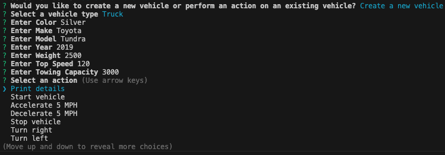

# 🚗 Vehicle Manipulator


[](http://creativecommons.org/publicdomain/zero/1.0/)
[Creative Commons License](http://creativecommons.org/publicdomain/zero/1.0/)


> An interactive CLI program that lets users create and control virtual vehicles with unique traits and behaviors.


---


## 📘 Table of Contents


- [License](#license)
- [Description](#description)
- [Installation](#installation)
- [Usage](#usage)
- [Contribution](#contribution)
- [Tests](#tests)
- [Questions](#questions)


---


## 🧾 Description


Vehicle Manipulator allows you to create custom vehicles or select pre-generated ones to perform various interactive actions. Each action reflects real-time changes based on the vehicle type, and any new vehicles you create become part of your library.


---


## ⚙️ Installation


```bash
git clone https://github.com/bjaegerthomas/Vehicle-Manipulator.git
cd Vehicle-Manipulator/dist
node index.js
```


---


## 🚀 Usage


After launching the app:


### 1. Choose a Pre-existing Vehicle


### 2. Perform Actions


Each vehicle shares common actions, but unique vehicles (e.g., motorbike or truck) offer specialized features like:


- Motorbike: **Wheelie**
 


- Truck: **Tow**
 
 
 


### 3. Create a Custom Vehicle





---


## 🤝 Contribution


1. Clone the repo and create a new branch:
```bash
git checkout -b feature/your-feature-name
```
2. Write clear, clean, and well-commented code.
3. Follow JS/TS best practices.
4. Submit a pull request with detailed explanations.


---


## 🧪 Tests


🎥 [Click here for walkthrough video](https://drive.google.com/file/d/1z1YEezYXWxMN-DV0gYL0_Dhb1OVh3NIQ/view)


---


## ❓ Questions


📬 Reach out with questions or collaboration ideas:


- GitHub: [bjaegerthomas](https://github.com/bjaegerthomas)
- Email: bjaegerthomas@gmail.com


---


> "Build it, drive it, bend the rules – then build another one."


